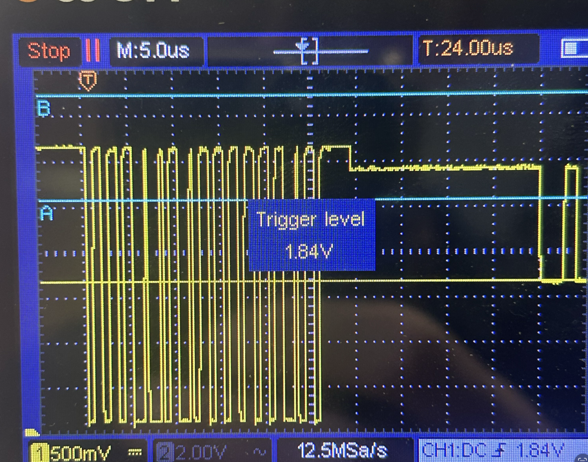
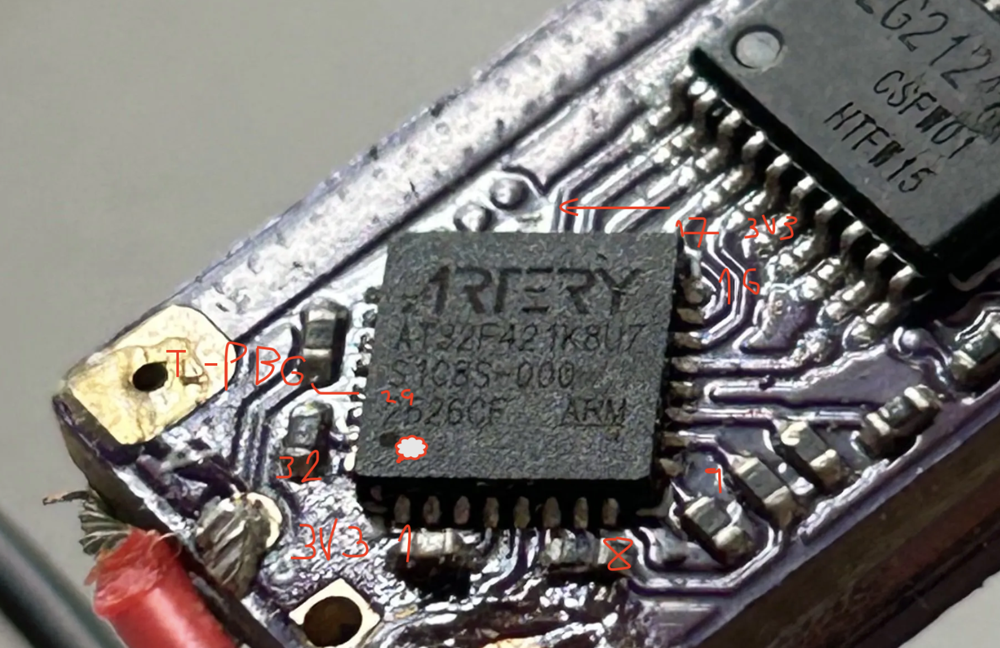
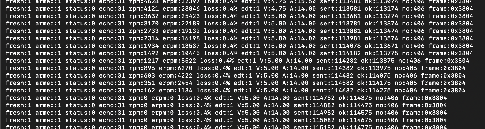

# AlfredoDShot — Purple 40A ESC notes

I wanted to share my empirical findings about making telemetry work with the
generic Purple 40A ESC I bought from AliExpress. We needed battery voltage and
eRPM telemetry for our battlebot project, and this fork contains the tested
ESP32-C3 example and wiring observations.

The original AlfredoDShot library and its full API documentation are here:

<https://github.com/AlfredoSystems/AlfredoDShot>

## ESC / MCU information from the firmware HEX

- Firmware file inspected: `AM32_FREELYRC_V2_F421_2.21.hex`
- HEX target identifier: `FREELYRC_V2_F421`
- MCU marking: `ARTERY AT32F421K8U7 2626CF`
- MCU: Artery AT32F421, Cortex-M4, QFN32 package
- Corresponding AM32 source version: v2.21

The AM32 v2.21 target defines approximately:

```c
#define FIRMWARE_NAME "FreelyRC2"
#define FILE_NAME "FREELYRC_V2_F421"
#define DEAD_TIME 60
#define HARDWARE_GROUP_AT_C
#define HARDWARE_GROUP_AT_540
#define USE_SERIAL_TELEMETRY
#define USE_LED_STRIP
#define WS2812_PIN GPIO_PINS_8
#define CURRENT_ADC_CHANNEL ADC_CHANNEL_6
#define CURRENT_ADC_PIN GPIO_PINS_6
#define VOLTAGE_ADC_CHANNEL ADC_CHANNEL_3
#define VOLTAGE_ADC_PIN GPIO_PINS_3
```

This indicates that the firmware was built for both current and battery-voltage
sensing, although the actual scaling still needs to be checked against external
meters.

## What made bidirectional telemetry work

The ESC has an approximately **1 kΩ series resistor already fitted** in its
signal path. An additional 1 kΩ pull-up loaded the ESC telemetry output; reply
low levels were around 1.8 V and were not reliable logic lows. A weaker external
pull-up (2.2–4.7 kΩ, with slower DShot if necessary) produced valid replies.

Use a common ground, pull up to 3.3 V, and measure at the signal bus/ESP32 side.
The ESP32 command low should be below 0.8 V and the ESC reply low should also be
below 0.8 V. The included `images/` directory contains scope and ESC photos.

## Test result

With the corrected resistor network, the AlfredoDShot ESP32-C3 test on GPIO2
decoded bidirectional DShot600 eRPM reliably: complete 31-pulse echoes, valid
RPM replies, and approximately 0.3% steady-state packet loss. The test sketch
in `pio_test/` repeatedly sends zero throttle, issues AM32 EDT command 13, and
then resumes low throttle.

The ESC returned valid eRPM, but no EDT voltage/current frames were observed in
this test. EDT support on this exact Purple 40A firmware build therefore remains
unconfirmed.

##images




